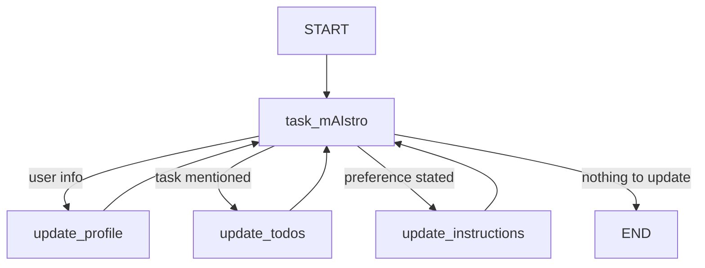

# TaskMind

TaskMind is a memory-powered AI chat assistant built with **LangGraph**. Unlike a typical chatbot that forgets everything after each session, TaskMind maintains long-term memory across conversations — it remembers who you are, keeps a running ToDo list, and learns your preferences for how you like tasks managed.

Built on top of the LangChain Academy's Module 5 (long-term memory) material, with a custom **Streamlit** front end replacing LangGraph Studio.

---

## Features

- 🧠 **Persistent user profile** — remembers your name, location, job, and personal connections across conversations
- ✅ **Smart ToDo tracking** — automatically adds, updates, and organizes tasks extracted from natural conversation
- ⚙️ **Adaptive instructions** — learns your preferences over time (e.g. how you like tasks logged) and adjusts accordingly
- 💬 **Simple chat interface** — built with Streamlit, no separate frontend framework required
- 🔗 **LangGraph-powered** — a stateful graph routes between conversation, profile updates, ToDo updates, and instruction updates
- 🔍 **Trustcall extraction** — uses [Trustcall](https://github.com/hinthornw/trustcall) for reliable structured-data extraction into Pydantic schemas

---

## Tech Stack

| Component        | Purpose                                      |
|-------------------|-----------------------------------------------|
| [LangGraph](https://github.com/langchain-ai/langgraph)        | Stateful agent graph / orchestration          |
| [LangChain](https://github.com/langchain-ai/langchain)        | LLM abstractions, message handling            |
| [Trustcall](https://github.com/hinthornw/trustcall)        | Structured memory extraction & patching       |
| [Streamlit](https://streamlit.io/)        | Chat UI                                        |
| Google Gemini / OpenAI | LLM backend (swappable)                  |

---

## Project Structure

```
module-5/
└── studio/
    ├── app.py                     # Streamlit chat front end
    ├── memory_agent.py            # Main LangGraph agent: profile, ToDo, instructions memory
    ├── memory_store.py            # Basic memory store example
    ├── memoryschema_profile.py    # Single-user profile memory schema
    ├── memoryschema_collection.py # Collection-based memory schema
    ├── configuration.py           # Runtime configuration (user_id, etc.)
    ├── requirements.txt
    └── .env                       # API keys (not committed)
```

---

## Setup

### 1. Clone the repository

```bash
git clone <your-repo-url>
cd <your-repo-name>
```

### 2. Create a virtual environment

```bash
python -m venv .venv
```

**Windows (PowerShell):**
```powershell
.venv\Scripts\Activate.ps1
```

**macOS/Linux:**
```bash
source .venv/bin/activate
```

### 3. Install dependencies

```bash
pip install -r requirements.txt
```

If running the Streamlit app specifically, make sure these are installed too:

```bash
pip install streamlit langchain-google-genai python-dotenv
```

### 4. Configure your API key

Copy the example env file and add your key:

```bash
cd module-5/studio
cp .env.example .env
```

Edit `.env`:

```env
GOOGLE_API_KEY="your-gemini-api-key-here"
```

> Get a free Gemini API key at [Google AI Studio](https://aistudio.google.com/).
> To use OpenAI instead, set `OPENAI_API_KEY` and swap the model import in `memory_agent.py` (see [Switching Providers](#switching-providers) below).

### 5. Run the app

```bash
streamlit run app.py
```

This opens the chat UI at `http://localhost:8501`.

---

## How It Works

1. **You send a message** in the chat.
2. The **`task_mAIstro`** node loads your existing profile, ToDo list, and preferences from memory, then decides whether to respond directly or update memory.
3. If memory needs updating, the graph routes to one of:
   - **`update_profile`** — extracts and saves personal details
   - **`update_todos`** — adds, updates, or marks tasks complete
   - **`update_instructions`** — learns new preferences you've expressed
4. Updated memory is saved to an in-memory store (`InMemoryStore`) and used to personalize future responses.



---

## Switching Providers

By default this project is configured for **Google Gemini**. To use **OpenAI** instead, edit `memory_agent.py`:

```python
from langchain_openai import ChatOpenAI

model = ChatOpenAI(model="gpt-4o-mini", temperature=0)
```

and set `OPENAI_API_KEY` in `.env` instead of `GOOGLE_API_KEY`.

---

## Notes & Limitations

- **Memory is in-memory only.** `InMemoryStore` and `MemorySaver` reset on every app restart — memory does not currently persist to disk or a database.
- **Free-tier API limits apply.** Gemini's free tier has per-minute and per-day request quotas; if you hit a `429` or `503` error, wait a bit and retry, or switch providers.
- **Single-user demo.** `user_id` and `thread_id` are hardcoded in `app.py` for simplicity — extend this for multi-user support.

---

## Roadmap / Ideas

- [ ] Persist memory to a database (e.g. SQLite, Postgres) instead of in-memory store
- [ ] Multi-user support with login
- [ ] Editable memory view in the UI (see/edit what the agent remembers)
- [ ] Deploy to Streamlit Community Cloud

---

## Acknowledgments

TaskMind is built on top of [LangChain Academy](https://github.com/langchain-ai/langchain-academy)'s Module 5 curriculum on long-term agent memory.

---

## License

MIT (or your preferred license — update this section accordingly)
